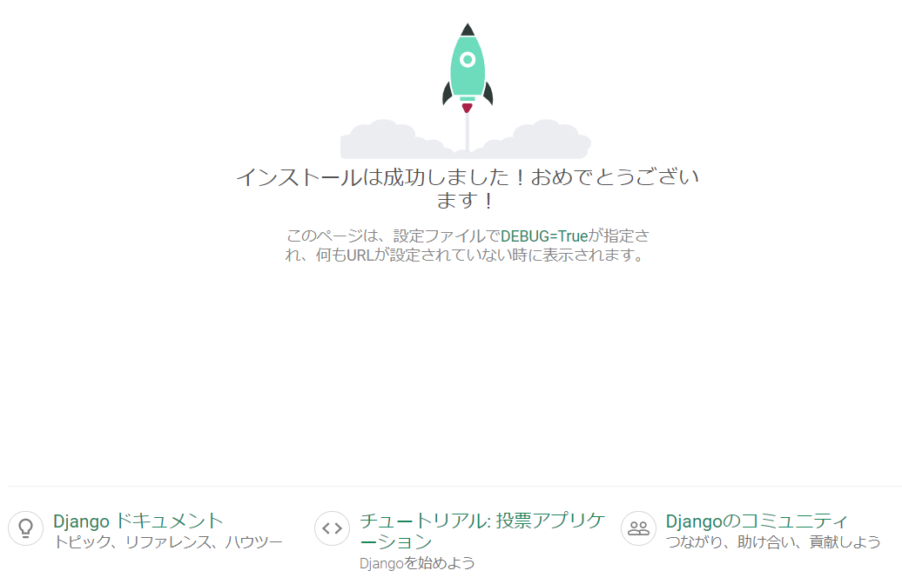

# djangoチュートリアル

## 仮想環境

仮想環境を作成する

```
$ python3 -m venv myvenv
```
### 仮想環境の開始
```
$ source myvenv/bin/activate
```
Djanogのインストール

pipを最新版にする
```
(myvenv) ~$ python3 -m pip install --upgrade pip
```
## requirementsファイルによってパッケージをインストールする

requirements.txtを作成する
```
django-template
├── myvenv
│   └── ...
└───requirements.txt
```

requirements.txt
```
Django~=2.2.4
```

Djangoをインストールする
```
(myvenv) ~$ pip3 install -r requirements.txt
```

## プロジェクトを作成する
```
(myvenv) ~$ django-admin startproject mysite .
```

## 設定変更

mysite/settings.pyに変更を加える

mysite/settings.py
```
ALLOWED_HOSTS = ['*']

LANGUAGE_CODE = 'ja'
TIME_ZONE = 'Asia/Tokyo'

STATIC_URL = '/static/'
STATIC_ROOT = os.path.join(BASE_DIR, 'static')
```

## データベースをセットアップ

```
(myvenv) ~$ python3 manage.py migrate
```

## Webサーバーを起動する

```
(myvenv) ~$ python3 manage.py runserver
```
URLにアクセスすると、Webページが表示されます。  
http://127.0.0.1:8000/

Webサーバーを停止するには、Ctrl + Cを同時に押すと停止します。



## 新しいアプリケーションの作成
```
(myvenv) ~$ python3 manage.py startapp blog
```

